# 課長研修（中産連 第120回）レポート

## 研修概要

| 項目 | 内容 |
|---|---|
| 研修名 | 第120回 課長研修（全4回シリーズ、今回は第1回・第2回） |
| 主催 | 一般社団法人 中部産業連盟（中産連） |
| 日程 | 2026年7月22日（水）・23日（木） |
| 参加者 | 廣田 和久 |
| 参加者層 | 製造業を中心とした中小企業の課長・管理職クラス 約27名 |
| 今回の範囲 | ①課長の役割理解、②戦略リーダー編 |

---

## 要旨

今回の研修で最も大きかったのは、課長として本来割くべき「管理」の時間と、現実に吸い取られている「実務」の時間が逆転していることを、自分の問題として正面から認識できたことだった。加えて、アンゾフ、ポーター、SWOTなどの戦略フレームワークは、知識として知っているだけでは足りず、現場の本質を捉えて人に伝えられるレベルまで引き上げる必要があると痛感した。さらに、異業種の課長同士で行う対話は、自分一人では見えない論点を引き出す「壁打ちの場」として非常に有効であり、社内にもこの機能を持ち込む価値があると感じた。

---

## 1日目で強く残ったこと

### 1. 管理と実務の比率を逆転させる必要性

初日の学びで最も重かったのは、課長の役割は「自分で片づけること」ではなく、「組織として前に進めること」だという原点だった。実務に追われるほど安心感はあるが、それでは課としての再現性も育成も進まない。管理者として必要なのは、部下に任せる前提で標準化し、観察し、言語化し、必要な場面で軌道修正する時間を意図的に確保することだと腹落ちした。

### 2. フレームワークを“知っている”から“本質を伝えられる”へ

講義では、戦略策定や問題解決の道具として複数のフレームワークが示された。ただし印象に残ったのは、フレームワークを埋めること自体を目的にしてはいけない、という点である。現状・阻害要因・打ち手・展開の筋道を、自分の言葉で説明できて初めて使えると言える。今後は、アンゾフ、ポーター、SWOTを「使える」から「本質を説明できる」段階へ上げていく必要がある。

### 3. 異業種ディスカッションは優秀な壁打ちになる

同じ製造業でも、会社規模も商流も課題の出方も異なる。その違いがあるからこそ、自社では当たり前になっている論点が言語化され、問い直される。個人で考えた内容より、グループで対話した内容の方が明らかに精度が上がった。社内でも、部門横断で問いをぶつけ合う場をつくる価値があると感じた。

---

## 写真付きメモ：初日で印象に残った講義資料

> ※手書きの個人メモ写真は、事前指示どおり本文には埋め込まず、講義資料とアンケート画像のみ反映しています。

### SWOT分析：環境を雑に見ないための基本型

 
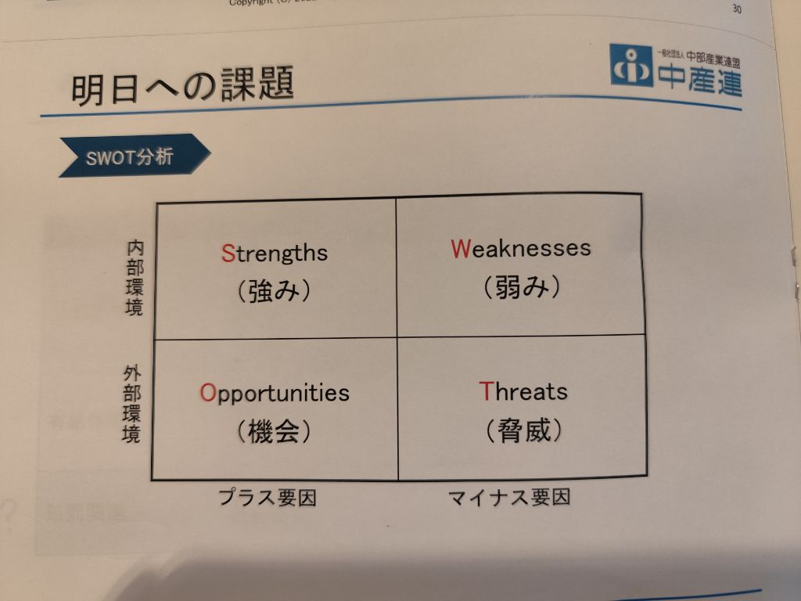

SWOTは基本形そのものはシンプルだが、重要なのは強み・弱み・機会・脅威を機械的に埋めることではなく、内部要因と外部要因を切り分けて、打ち手につながる解像度まで掘り下げることだと理解した。

### 中長期ビジョンから逆算する

 
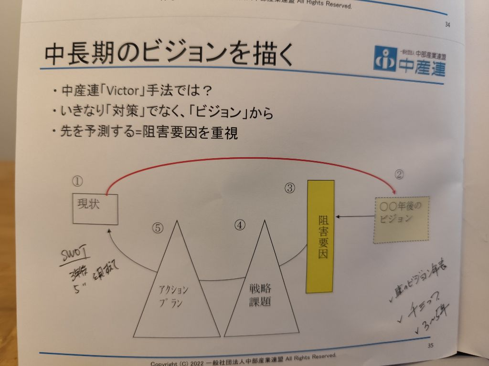

「現状から対策に飛びつく」のではなく、「将来どうありたいか」を置いたうえで阻害要因と戦略課題を見つける流れが示されていた。開発テーマでも、目先の改善案ではなく到達したい姿から逆算する思考が必要だと感じた。

### 戦略策定の手順

 
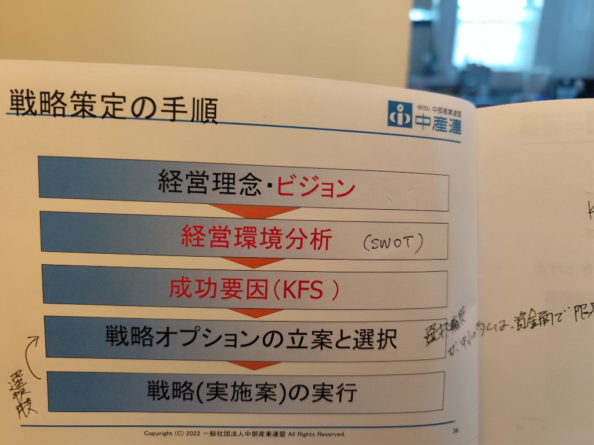

経営理念・ビジョンから始まり、環境分析、成功要因、戦略オプション、実行へと落としていく流れが整理されていた。フレームワークは単独で使うのではなく、順番を持ってつなぐことで意味を持つことを再確認した。

### ポーターの競争戦略

 
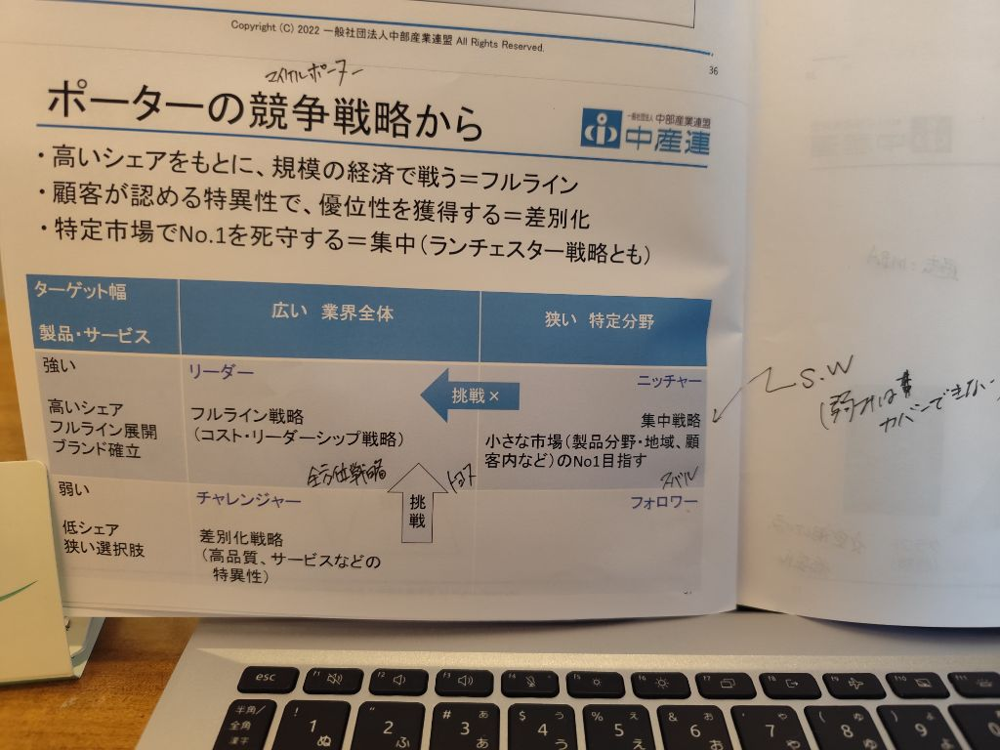

高シェアか、特定分野に絞るか、差別化するか。競争戦略は“何でもやる”ではなく、“どこで戦うかを決める”ことそのものだと分かる資料だった。自部署のテーマ選定でも、守る市場と攻める市場を曖昧にしない必要がある。

### RBV：競争力は社外条件だけでは決まらない

 
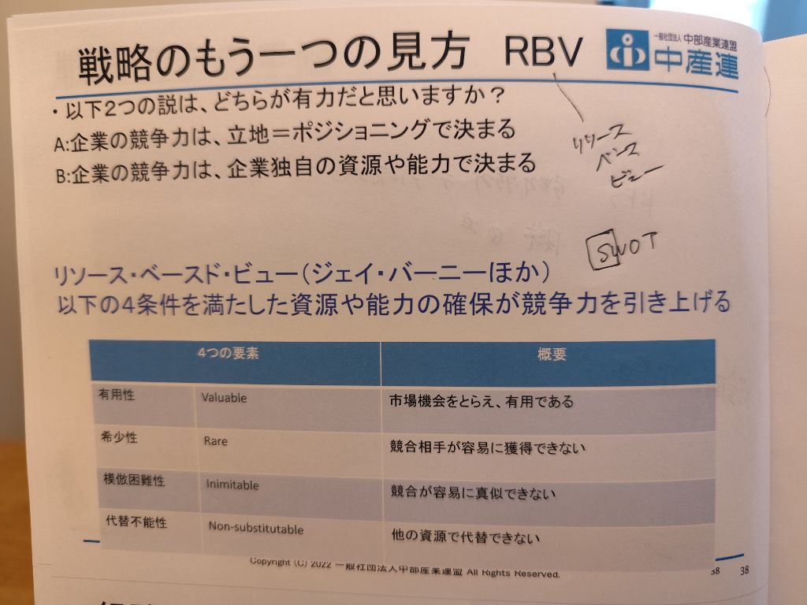

競争力を市場ポジションだけでなく、自社固有の資源・能力から見るRBVの視点も印象に残った。技術・ノウハウ・顧客理解など、真似されにくい資産をどう積み上げるかが、製造業の現場には特に重要だと感じた。

### 新事業創出とSTP発想

 
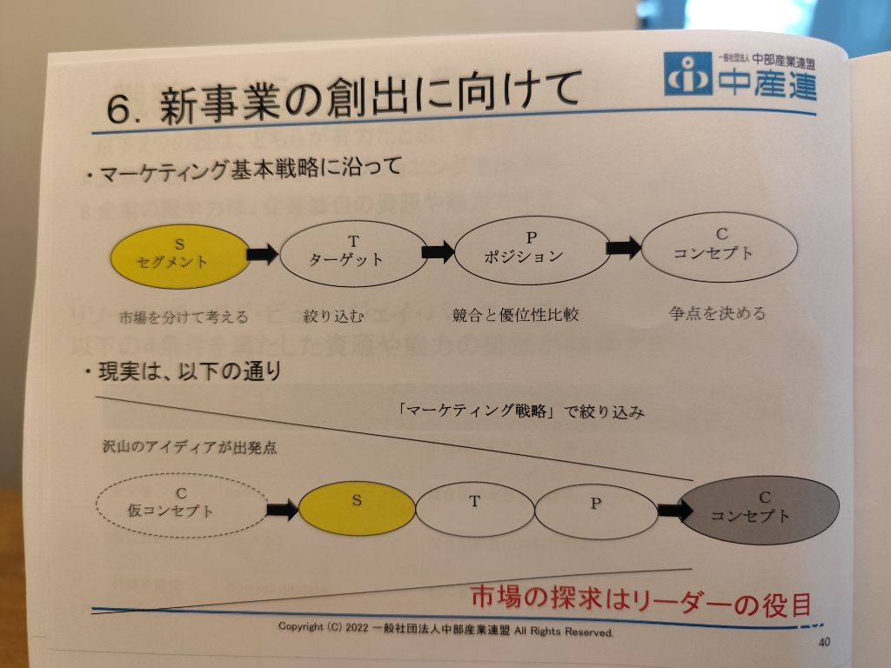

新事業は単なる思いつきではなく、市場を分け、狙いを絞り、立ち位置を定め、価値を定義する流れで考えるべきだと整理されていた。アイデアを並べるだけでなく、誰に何をどう届けるのかを明確にする必要がある。

### アンゾフのマトリクス：どの山に登るかを決める

 
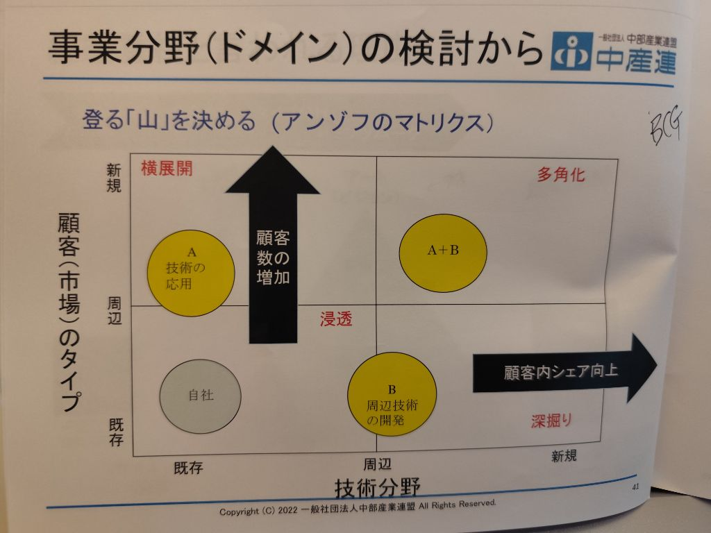

既存市場・新規市場、既存技術・周辺技術という軸で、自社がどの方向に進むかを考える資料。テーマを増やす前に、そもそもどの領域へ資源を寄せるのかを決める重要性を感じた。

### 方針管理の基本サイクル

 
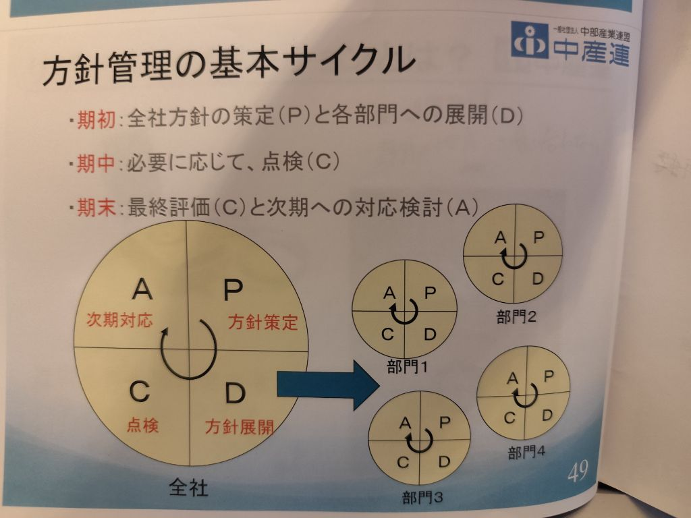

方針管理は単年度の掛け声ではなく、P-D-C-Aを全社から各部門まで回す仕組みであることが整理されていた。計画を立てるだけで終わらず、途中で点検し、次期へ接続するところまで管理の仕事である。

### 方針の連鎖：全社方針を末端まで浸透させる

 
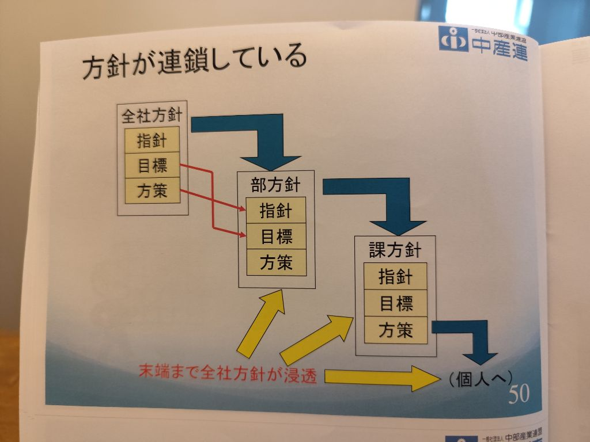

全社方針が部方針、課方針、個人へと連鎖していく図は、管理職の役割を非常に分かりやすく示していた。自分の課で止めず、メンバーの行動レベルまで落とし込めて初めて展開したと言える。

### 方針設定の進め方

 
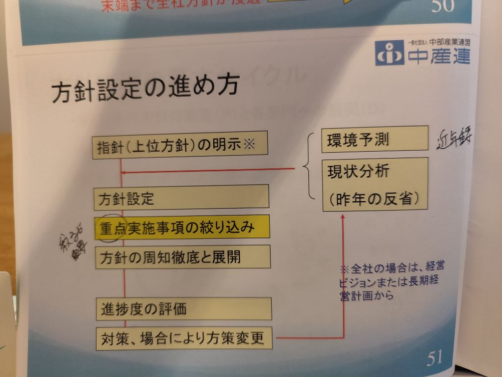

環境予測、現状分析、重点事項の絞り込み、周知、進捗評価、必要時の修正という流れは、そのまま日常のマネジメントにも置き換えられる。課長に必要なのは、方針を作ること以上に、回る形で運用することだと感じた。

### まとめは「ストーリー化」する

 
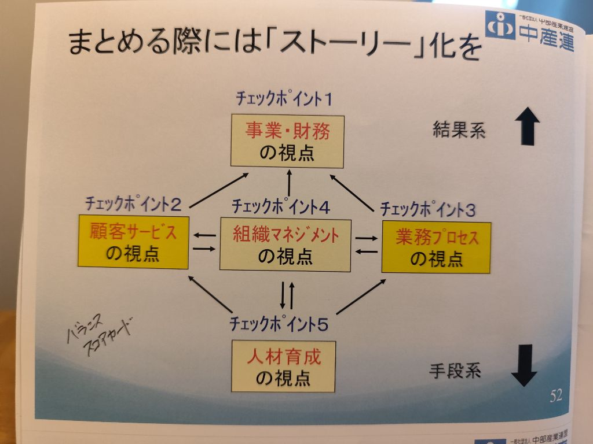

事業・財務、顧客サービス、業務プロセス、組織マネジメント、人材育成の視点をつなげて説明する考え方は、部門方針を伝える際にも有効だと感じた。単発の施策ではなく、なぜその施策が必要かを筋道立てて語る力が必要である。

### 点検はプロセスまで見る

 
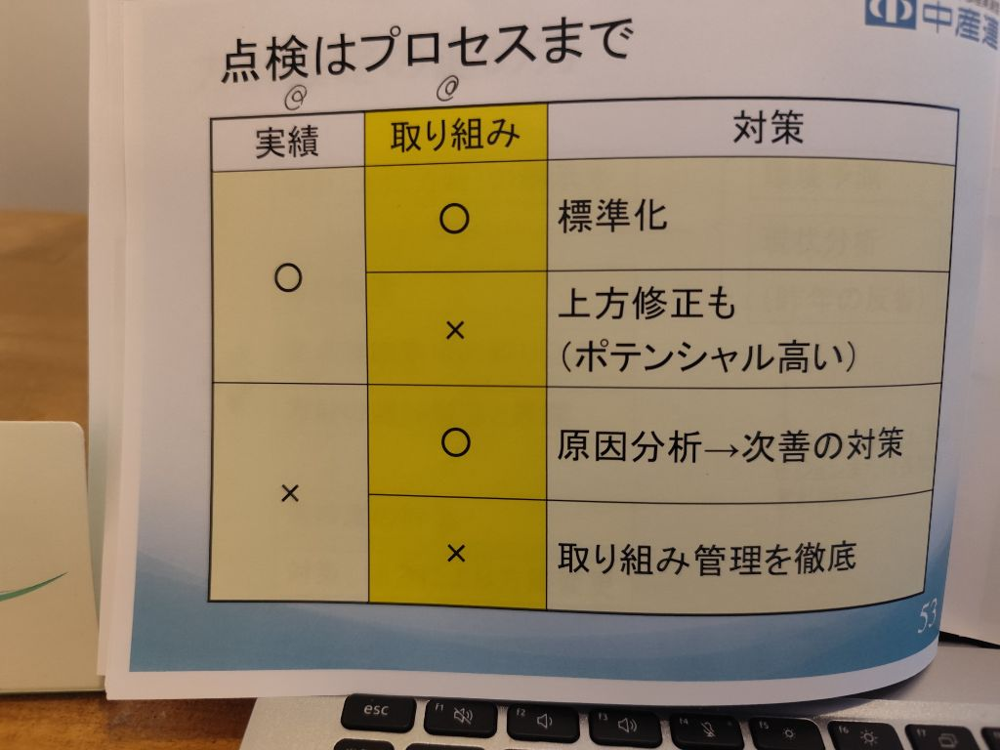

結果だけでなく、取り組みの中身まで見て対策を変えるという考え方は、管理職として特に重要だと感じた。結果が良い・悪いだけで片づけず、進め方に手を入れる姿勢が必要である。

---

## アンケート結果から見えた共通課題

### 受講者の属性と、現在の管理業務比率

 
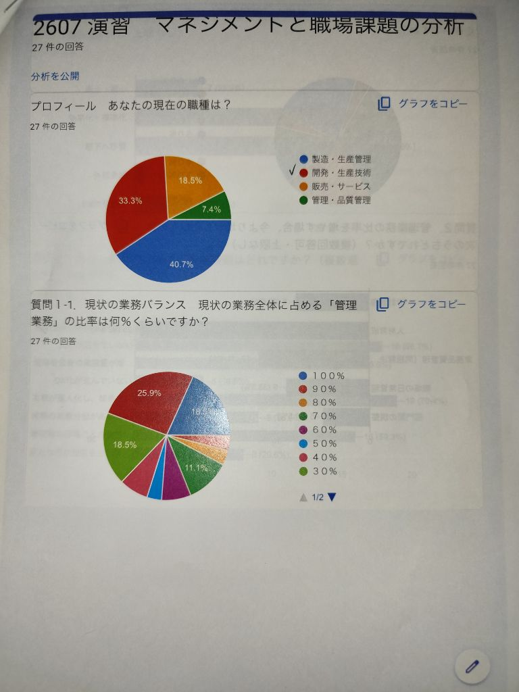

受講者は製造・生産管理と開発・生産技術が中心で、現場に近い課長が多数を占めていた。管理業務の比率は高いとは言い難く、実務に引っ張られている実態が共通していることが見えた。

### 理想の業務比率と、増やしたい管理業務

 
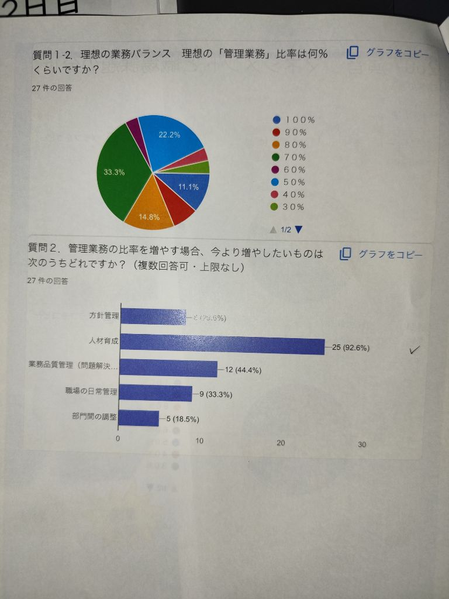

理想の管理業務比率は「70%」が最多で、増やしたい管理業務は「人材育成」が圧倒的だった。皆、管理者として本来やるべきことは分かっているが、その時間が取れていないという構図が明確に出ていた。

### 実務を減らす方法と、部門の業務課題

 
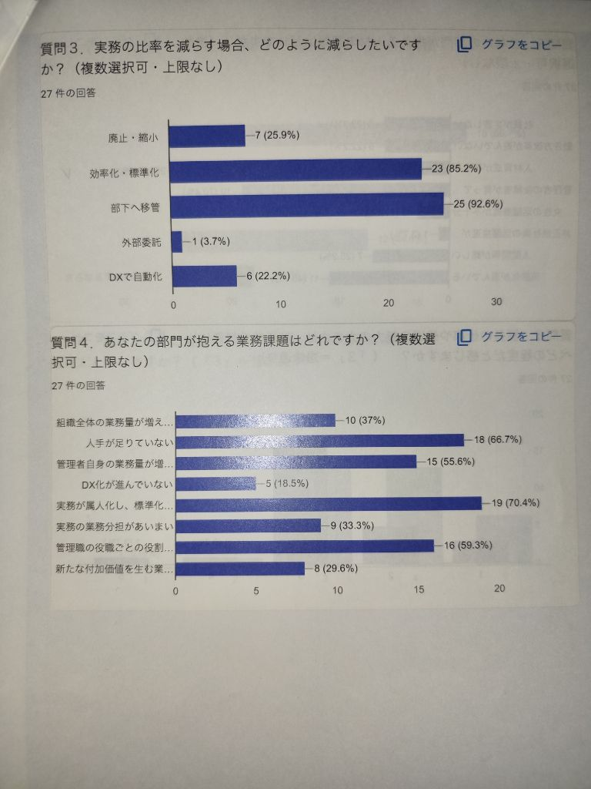

実務を減らす方法としては「部下へ移管」「効率化・標準化」が上位だった。一方で、部門課題としては「属人化」「役割の曖昧さ」が大きく、任せたくても任せられない構造が背景にあることが読み取れた。

### 人材課題と、課長職の魅力

 
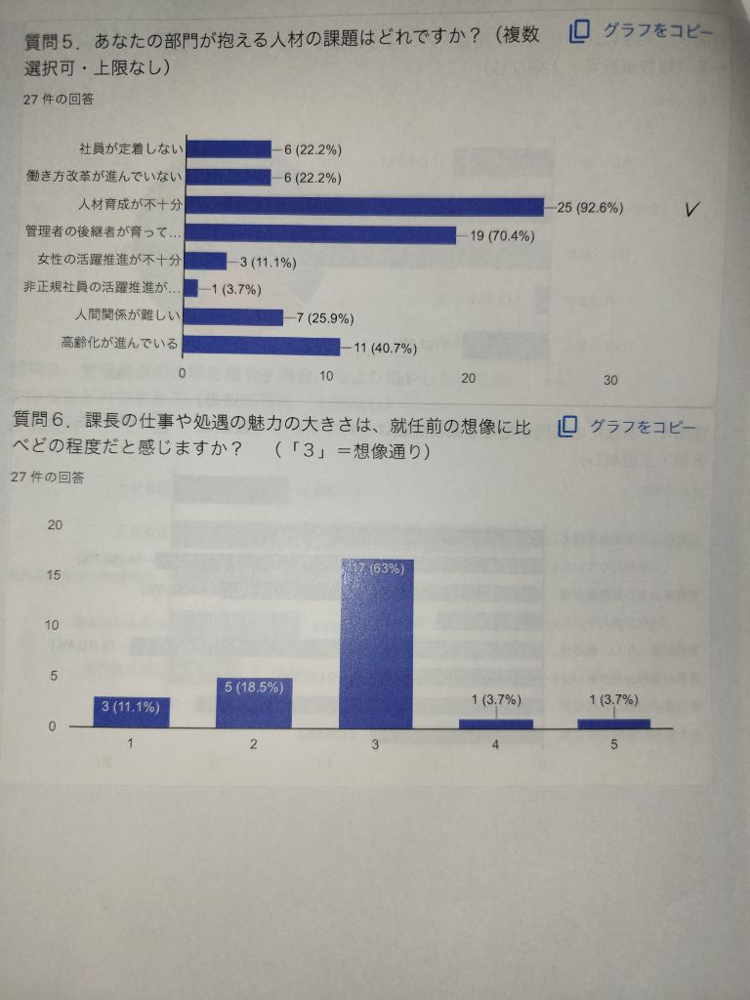

人材課題では「人材育成が不十分」が突出し、次いで「管理者の後継者が育っていない」が続いた。課長職の魅力そのものは“想像通り”という回答が最多で、やりがいはあるが、仕組みとして支えきれていない印象を受けた。

### 負担感の正体

 
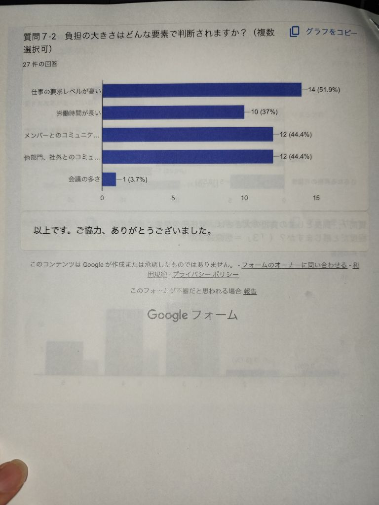

課長職の負担は、仕事の要求水準の高さに加え、メンバーや他部門・社外とのコミュニケーション負荷が大きいことに起因していた。つまり、課長は単なる中間管理ではなく、多方向の調整役として負荷を引き受けている。

---

## 今回の学びを自部署へどう持ち帰るか

### 1. 管理:実務の比率を意図的に逆転させる

現状の延長では、実務は自然増し、管理は自然減する。だからこそ、部下への移管、標準化、レビューの仕組み化を通じて、管理者が対話・育成・調整に使う時間を先に確保する必要がある。

### 2. まず自分の言語化力・伝達力・発信力を上げる

人を育てるには、何をどう考え、どこを見て、何を期待するのかを相手に伝わる形で表現できなければならない。今回のグループワークで、自分はまだ「分かっている」ことを「伝わる形にする」点に課題があると感じた。

### 3. 社内に“壁打ちの場”をつくる

異業種での対話が有効だったのは、思考の前提を崩してくれるからだった。社内でも、開発・製造・営業・品質など、立場の異なる人同士がテーマをぶつけ合う場をつくれば、意思決定の質は上がるはずである。

### 4. フレームワークを“説明できる道具”へ育てる

アンゾフ、ポーター、SWOTは、知識としては既に触れている。しかし今後必要なのは、自部署のテーマに引きつけて、なぜその整理が必要かを人に説明できるレベルまで高めることだ。研修で得たのは、新しい言葉そのものより、道具の使い方を本質に寄せる視点だった。

---

## まとめ

今回の2日間で得た一番の収穫は、「課長として何をやるべきか」が少し整理されたことではなく、「今の自分はどこがまだ足りていないか」がかなり具体的になったことだった。特に、管理と実務の比率、伝える力、他者との壁打ち、そして戦略フレームを使う深さの4点は、今後そのまま自分の改善テーマになる。残り2回の研修では人材育成が主テーマになるが、その前提として、まずは自分の言語化力・伝達力・発信力を一段上げることに取り組みたい。
